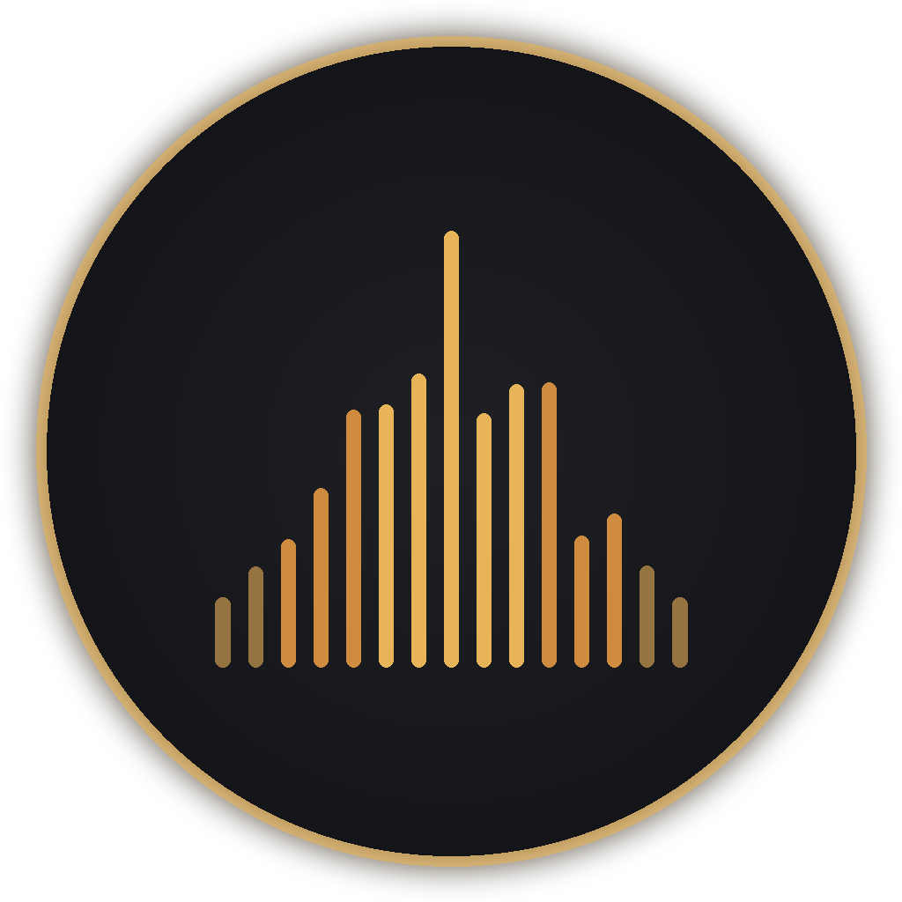

# Auralis

**A lossless-first music player and library manager for people who hear the difference.**

Auralis is a desktop audio player in the spirit of MusicBee, redesigned from the ground up
with an audiophile's priorities: your library's *quality* is a first-class citizen — sample
rates, bit depths, codecs, and dynamics are surfaced everywhere — wrapped in a dark,
brass-accented interface built for long listening sessions.



## Features

### Library
- **Deep format support for indexing** — FLAC, WAV, AIFF, ALAC, APE, WavPack, DSD (.dsf/.dff),
  MP3, AAC, OGG, Opus, WMA. Full metadata, embedded artwork, ReplayGain tags.
- **Quality-aware everywhere** — hi-res (`24/96`, `24/192`), lossless, and DSD badges on albums
  and tracks; per-track codec / bit depth / sample rate / bitrate readouts.
- **Fast incremental scans** — only changed files are re-read on rescan.
- **Albums · Artists · Tracks · Genres** views, global search (`Ctrl F`), sortable columns,
  playlists, play queue with drag-free "Play Next / Add to Queue".
- **Most Played** — a built-in smart collection of your top 25 tracks. A play is counted
  once you're halfway through a track (or four minutes in), scrobble-style.
- **Smart playlists** — rules-based auto-updating playlists (match all/any of: artist,
  album, genre, year, rating, play count, days since played/added, sample rate, length,
  lossless) with sort and limit. Build them from the ⚡ button in the sidebar.
- **Ratings** — five-star ratings on every track row (click to rate, click again to clear),
  sortable and usable in smart-playlist rules.
- **Artist profiles** — artist pages show a photo (Deezer) and a biography snippet
  (Wikipedia) with a Read-more expander, fetched on demand and cached locally.
  Toggle off under Settings → Audio Output → "Online artist info" if you prefer
  a fully offline player.

### Playback engine
- **Gapless playback** — the next track is pre-buffered and handed off without silence.
- **10-band parametric EQ** — shelving ends, peaking mids, automatic pre-amp headroom
  compensation so boosts never clip. Presets included (Warm Tube, V-Shape, Vocal, …),
  processed in the 32-bit float DSP domain.
- **ReplayGain** — track or album mode, read from your files' tags.
- **Output device selection** — route playback straight to your DAC.
- **Live spectrum analyzer** (log-frequency, peak-hold) and **stereo VU meters**.
- **Lyrics on the Now Playing screen** — from `.lrc`/`.txt` side files, embedded tags, or
  LRCLIB lookup (cached). Time-synced lyrics follow the music with the active line
  highlighted; click a line to seek. The artwork slides over gracefully when lyrics are
  present and recenters when they're not. Toggle in Settings.
- **Last.fm scrobbling** — standard half-track/four-minute rule, now-playing updates,
  and an offline queue that retries failed scrobbles. Bring your own free API key
  (last.fm/api/account/create), connect once in the browser, done.
- **Mini player** — a compact always-on-top window (art, transport, seek) in the spirit
  of MusicBee's mini mode. Toggle from the player bar; pop back to full size anytime.
- **OS media key support** via MediaSession.

### Signal path indicator
Click the quality badge in the player bar for a Roon-style stage-by-stage readout of
exactly what is happening to the stream — source format, decoder, every active DSP
stage, quantization/dither, and the output device — with a bit-perfect / lossless /
lossy verdict light.

### Resampling & Dither (Settings)
- **SoX resampler (soxr)** sample-rate conversion on the native path — fixed output
  rates 44.1–384 kHz at selectable precision (20/28/33-bit).
- **Output format selection** (32-bit float, or 32/24/16-bit integer) with **TPDF
  dither** and optional **2nd-order noise shaping** applied once at the final
  quantization (measured: ~20 dB lower in-band quantization noise vs. flat dither).

### Native Direct Output (Settings → Output Engine)
- **Direct host-API output** via RtAudio: **ASIO** (direct DAC communication — bypasses
  the Windows mixer entirely), **WASAPI**, and **DirectSound**, with device and buffer-size
  selection.
- **FFmpeg decode** — the native path decodes *everything* the library indexes: FLAC, ALAC,
  APE, WavPack, DSD (converted to 176.4 kHz PCM), WAV/AIFF, MP3 (with LAME encoder-delay/
  padding trim for true gapless), AAC, OGG, Opus.
- **64-bit float DSP chain** — ReplayGain, EQ, and speaker correction are computed in
  double precision before a single 32-bit float quantization at the output.
- **Bit-perfect mode** — source samples go to the driver untouched as 32-bit integer PCM
  (verified bit-exact): no DSP, no dither, no software volume. Use your DAC's volume.
- **WASAPI Exclusive mode** — a dedicated native module takes exclusive-mode control of the
  endpoint (event-driven, format-negotiated), bypassing the Windows mixer and session volume
  entirely. Falls back to the shared path if the device refuses the format.
- **Native DSD over PCM (DoP)** — DSF files can play as the untouched 1-bit DSD stream
  wrapped in marker-framed PCM for DoP-aware DACs (Settings → DSD playback). PCM conversion
  remains the compatible default.
- **Gapless** — decode-ahead into a continuous device stream.

### Speaker correction (Settings → Speaker Correction)
JRiver-style room correction, per channel: level trim, distance delay (ms), polarity
invert, and up to 8 parametric EQ bands per speaker. Runs in the active engine's DSP
chain — 64-bit float on the native path, Web Audio nodes on the standard path — and is
bypassed automatically in bit-perfect mode.

### Network audio (Settings → Output Engine / Media Server)
- **UPnP/DLNA media server** — Auralis advertises itself on the network (SSDP) and serves
  the library to any streamer, with full hi-res metadata (sample rate, bit depth, art)
  and Range-capable, DLNA-tagged HTTP streaming of the **original untouched files**.
  Albums, artists, genres, tracks, and your playlists (smart ones included) are all
  browsable from the streamer's own app.
- **Renderer as an output zone** — pick *Network Renderer (UPnP / OpenHome)* as the
  output engine and Auralis drives a hardware streamer (WiiM, Linn, Lumin, Cambridge,
  Volumio, …) as its player: transport, seek, volume, and **gapless handoff** via
  `SetNextAVTransportURI` (UPnP AV) or playlist insertion (OpenHome). The renderer pulls
  the audio bit-perfect from the media server — no transcoding in the path.

### Honest notes for the discerning ear
The **Standard** engine decodes via Chromium (FLAC / WAV / AIFF / MP3 / AAC / OGG / Opus)
and runs at the output device's shared-mode rate; use **Native Direct Output** for the
full format list and direct API access. WaveOut/MME is superseded by DirectSound and
intentionally not offered. On the network side, Auralis speaks **UPnP AV and OpenHome** —
it does not (and cannot) speak Roon RAAT or HQPlayer NAA, which are proprietary.

## Install (Windows)

Grab `Auralis-Setup-<version>.exe` from the releases page (or build it yourself, below),
run it, and pick an install directory. The installer creates Start Menu and desktop
shortcuts. No telemetry, no accounts, no nonsense.

### Auto-updates

The installed app checks GitHub Releases on startup (toggle under Settings →
About & Updates), downloads new versions in the background using differential
blockmap updates, and offers a one-click restart — declined updates install on
the next quit. Publishing an update is just pushing a tag:

```bash
git tag v1.3.1 && git push origin v1.3.1
```

The CI workflow builds the installer and publishes the release (including the
`latest.yml` update manifest) automatically.

## Build from source

```bash
npm install
npm start            # run in development
npm run dist:win     # build the Windows NSIS installer → release/Auralis-Setup-*.exe
```

Building the Windows installer works on Windows and on Linux (electron-builder
cross-builds NSIS). If your network blocks GitHub release downloads, set:

```bash
export ELECTRON_MIRROR="https://npmmirror.com/mirrors/electron/"
export ELECTRON_BUILDER_BINARIES_MIRROR="https://npmmirror.com/mirrors/electron-builder-binaries/"
```

A GitHub Actions workflow (`.github/workflows/build.yml`) builds the installer on every
tag push (`v*`) and attaches it to a GitHub Release — or run it manually from the
Actions tab (workflow_dispatch) and download the artifact.

## Architecture

```
electron/main.js      Main process — window, library scanner (music-metadata),
                      JSON persistence, `auralis://` streaming protocol (Range-capable)
electron/preload.js   contextBridge IPC surface (no nodeIntegration in the renderer)
src/index.html        App shell
src/css/styles.css    Design system
src/js/player.js      AudioEngine — dual-element gapless graph, EQ, ReplayGain, sinks
src/js/visualizer.js  Spectrum analyzer + stereo VU meters
src/js/app.js         Views, queue, playlists, settings, keyboard shortcuts
```

## License

MIT
